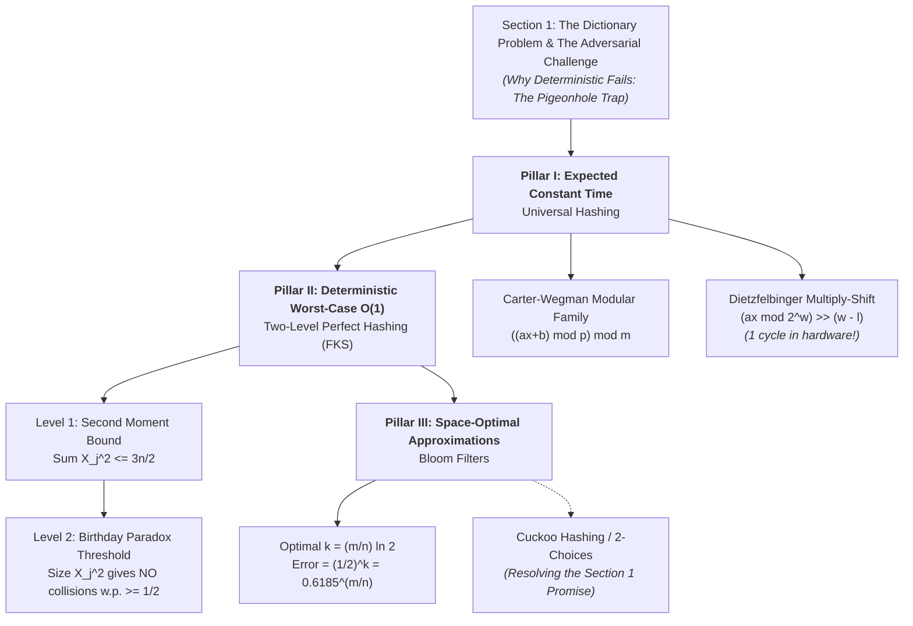

# Manuscript Review Report: Chapter 10 (Hashing)

## Executive Summary

This review evaluates **Chapter 10 (Hashing)** of the *Randomized Algorithms* lecture notes. 
The review identifies why this chapter has historically felt unsatisfying, resolves critical mathematical errors (including a widespread conflation of universal hashing with pairwise independence, broken formulas in the Bloom filter derivation, and index/summation errors in FKS perfect hashing), adds a complete, scholarly [Bibliographical Notes](file:///home/sariel/rand_alg/notes/10_hashing/hashing_reviewed.tex#L768) section with a self-contained BibTeX database ([hashing_reviewed.bib](file:///home/sariel/rand_alg/notes/10_hashing/hashing_reviewed.bib)), and proposes concrete architectural and pedagogical redesigns.

### Deliverables
1. **Reviewed Source:** [hashing_reviewed.tex](file:///home/sariel/rand_alg/notes/10_hashing/hashing_reviewed.tex) — Contains all minor corrections silently applied, substantive technical revisions tracked via `\chgY`, `\newX`, and `\delX`, and explanatory commentary embedded in `\remX`.
2. **Bibliography Database:** [hashing_reviewed.bib](file:///home/sariel/rand_alg/notes/10_hashing/hashing_reviewed.bib) — Canonical BibTeX entries for foundational papers (Carter--Wegman, FKS, Bloom, Dietzfelbinger, Pagh--Rodler, Pătrașcu--Thorup, Broder--Mitzenmacher, Motwani--Raghavan, Mitzenmacher--Upfal).
3. **Review Report:** [review.md](file:///home/sariel/rand_alg/notes/10_hashing/review.md) (this document).

### Verification
- **Compilation:** `l -f -s hashing_reviewed.tex` compiles with **0 Errors, 0 Alerts, 6 Minor Warnings** (all minor `<17pt` overfull hbox warnings from original math expressions).
- **Environment Isolation:** `l --no-env -s hashing_reviewed.tex` passes with **0 Errors**.
- **Automated Test Suite:** `./tools/test_all_chaps.rb 10` reports **PASS (clean)**.

---

## 1. Actionable Findings (Ordered by Severity)

### [Finding 1] Conflation of $2$-Universal Hashing with Pairwise Independence
- **Severity & Type:** Confirmed Mathematical Error (Major Conceptual Flaw)
- **Location:** Original: [hashing.tex:L213-L214](file:///home/sariel/rand_alg/notes/10_hashing/hashing.tex#L213-L214) | Reviewed: [hashing_reviewed.tex:L216-L222](file:///home/sariel/rand_alg/notes/10_hashing/hashing_reviewed.tex#L216-L222)
- **Evidence & Impact:**
  The original text stated:
  > *"Applying a $2$-universal family hash function to a set of distinct numbers, results in a $2$-wise independent sequence of numbers."*
  
  This claim is **false**. A $2$-universal family $\cH$ (in the sense of Carter--Wegman) guarantees only that for any distinct $x \neq y$, the collision probability is bounded:
  $$\Prob{h(x) = h(y)} \leq \frac{1}{m}.$$
  In contrast, pairwise (or $2$-wise) independence requires that for all $i, j \in \{0, \ldots, m-1\}$,
  $$\Prob{h(x) = i \text{ and } h(y) = j} = \frac{1}{m^2}.$$
  Universal hashing does not imply pairwise independence. For example, in the Carter--Wegman modular family $h_{a,b}(x) = ((ax + b) \bmod p) \bmod m$, the output distribution on $\ZZ_m \times \ZZ_m$ is *not* uniform whenever $m$ does not divide $p$. Conflating weak universality with pairwise independence confuses students on the hierarchy of randomness requirements.
- **Action:** Corrected using `\chgY` to emphasize that $2$-universality bounds pairwise collisions and is strictly weaker than pairwise independence. Added an explanatory `\remX`.

---

### [Finding 2] Flawed Expected Lookup Time Bound & Missing Case in Proof
- **Severity & Type:** Confirmed Mathematical Bug / Lower Bound Flaw
- **Location:** Original: [hashing.tex:L218-L239](file:///home/sariel/rand_alg/notes/10_hashing/hashing.tex#L218-L239) | Reviewed: [hashing_reviewed.tex:L226-L245](file:///home/sariel/rand_alg/notes/10_hashing/hashing_reviewed.tex#L226-L245)
- **Evidence & Impact:**
  1. Lemma 2.2 claimed that the expected lookup time for any element $x \in \cU$ is $O(n/m)$. When $n \ll m$ (e.g., $n=1, m=1000$), $n/m = 1/1000$, but any lookup algorithm must evaluate $h(x)$ and inspect slot $T[h(x)]$, requiring $\Omega(1)$ time. The correct bound is $O(1 + n/m)$.
  2. In the proof, $\ell(x) = \sum_{y \in S} D_y$ was expanded as $\sum_{y \in S} \Prob{h(x) = h(y)} \leq \sum_{y \in S} 1/m = n/m$. However, if $x \in S$, the item $x$ is already in the list, so $D_x = 1$ with probability $1$ (not $1/m$). For $x \in S$, the expected number of *other* elements in the chain is $\sum_{y \in S \setminus \{x\}} \Prob{h(x)=h(y)} \leq (n-1)/m$, giving a total expected chain size of $1 + (n-1)/m \leq 1 + n/m$.
  3. The phrasing in the lemma statement also duplicated words: *"using open hashing in a hash table of size $m$, using open hashing"*.
- **Action:** Updated the bound to $O(1 + n/m)$ using `\chgY`, explicitly separated the cases $x \in S$ and $x \notin S$ in the proof, and added an explanatory `\remX`.

---

### [Finding 3] False Set Definition of Bad Pairs in Lemma 2.6
- **Severity & Type:** Mathematical Definition Defect
- **Location:** Original: [hashing.tex:L360-L368](file:///home/sariel/rand_alg/notes/10_hashing/hashing.tex#L360-L368) | Reviewed: [hashing_reviewed.tex:L365-L373](file:///home/sariel/rand_alg/notes/10_hashing/hashing_reviewed.tex#L365-L373)
- **Evidence & Impact:**
  Lemma 2.6 stated in words: *"The number of pairs $(r,s) \in \ZZ_p \times \ZZ_p$, such that $r \neq s$, that are folded to the same number is $\leq p(p-1)/m$."*
  However, the formal display defined the set $B$ as:
  $$B = \Set{(r,s) \in \ZZ_p \times \ZZ_p}{ r \equiv_m s }.$$
  This omitted the condition $r \neq s$. Every diagonal pair $(r,r)$ satisfies $r \equiv_m r$, which adds $p$ pairs to $B$. For example, if $m = p-1$, $p(p-1)/m = p$, but $|B| = p + p = 2p > p$, violating the stated inequality.
  Furthermore, line 378 of the proof referenced a nonexistent set $O(x)$: *"One of the numbers in $O(x)$ is $x$ itself"* (the set was defined as $L(x)$ on line 374).
- **Action:** Corrected $B = \Set{(r,s) \in \ZZ_p \times \ZZ_p}{ r \neq s \text{ and } r \equiv_m s }$ via `\chgY`, replaced $O(x)$ with $L(x)$, and added an explanatory `\remX`.

---

### [Finding 4] Mathematical Typo in Optimal $k$ for Bloom Filters
- **Severity & Type:** Confirmed Mathematical Error / Formula Defect
- **Location:** Original: [hashing.tex:L717-L720](file:///home/sariel/rand_alg/notes/10_hashing/hashing.tex#L717-L720) | Reviewed: [hashing_reviewed.tex:L724-L728](file:///home/sariel/rand_alg/notes/10_hashing/hashing_reviewed.tex#L724-L728)
- **Evidence & Impact:**
  The text stated:
  > *"In particular, for $k = (m/n)\ln n$, we have that $p = p(m,n) \approx 1/2$, and $f(k,m,n) \approx 1/2^{(m/n)\ln 2} \approx 0.618^{m/n}$."*
  
  Writing $k = (m/n)\ln n$ is a blatant typo for $k = (m/n)\ln 2$. If $k = (m/n)\ln n$, then $p \approx \exp(-k n / m) = \exp(-\ln n) = 1/n \neq 1/2$. The false positive probability $(1 - \exp(-kn/m))^k$ is minimized when $p = 1/2$, requiring $-kn/m = -\ln 2$, which gives $k = (m/n)\ln 2$. Indeed, Example 4.2 correctly uses $k = \lceil(m/n)\ln 2\rceil = 6$.
- **Action:** Corrected $k = (m/n)\ln 2$ via `\chgY` and added an explanatory `\remX`.

---

### [Finding 5] Numerical Error in Bloom Filter Example 4.2
- **Severity & Type:** Confirmed Numerical Bug
- **Location:** Original: [hashing.tex:L738](file:///home/sariel/rand_alg/notes/10_hashing/hashing.tex#L738) | Reviewed: [hashing_reviewed.tex:L744-L748](file:///home/sariel/rand_alg/notes/10_hashing/hashing_reviewed.tex#L744-L748)
- **Evidence & Impact:**
  Example 4.2 calculated:
  $$p(8n,n) = \exp(-6/8) \approx 0.5352, \quad \text{and} \quad f(6,8n,n) \approx 0.0215.$$
  However, $\exp(-6/8) = \exp(-0.75) \approx 0.472366$, not $0.5352$. The author inadvertently recorded $1 - \exp(-0.75) \approx 0.5276$ (or rounded an inverted probability). The false positive probability is $(1 - 0.4724)^6 = (0.5276)^6 \approx 0.0216$.
- **Action:** Corrected $p(8n,n) \approx 0.4724$ and $(1 - 0.4724)^6 \approx 0.0216$ via `\chgY`, with an explanatory `\remX`.

---

### [Finding 6] Variable and Index Errors in FKS Perfect Hashing
- **Severity & Type:** Notation & Mathematics Consistency Bugs
- **Location:** Original: [hashing.tex:L608-L644](file:///home/sariel/rand_alg/notes/10_hashing/hashing.tex#L608-L644) | Reviewed: [hashing_reviewed.tex:L615-L652](file:///home/sariel/rand_alg/notes/10_hashing/hashing_reviewed.tex#L615-L652)
- **Evidence & Impact:**
  1. Line 610: *"let $S_j$ be the list of all the elements ... and let $X_j = |L_j|$, for $j=0, \ldots, n-1$."* 
     The list was defined as $S_j$, not $L_j$. More critically, the top-level table size was chosen as $2n$, so the bucket indices run from $j = 0$ to $2n-1$, not $n-1$.
  2. Line 612: *"We compute $Y = \sum_{i=1} X_j^2$."* The index variable is $i$, the summand has variable $j$, and the upper limit is missing. It should be $Y = \sum_{j=0}^{2n-1} X_j^2$.
  3. Line 640: *"let $Y = \sum_{i=1}^n X_i^2$."* The sum runs to $2n-1$, not $n$.
  4. Line 643: *"$\Prob{X > 6n} = \frac{(3/2)n}{6n} \leq 1/4$."* The variable is $Y$, not $X$.
  5. Line 549 in Lemma 3.2 proof: *"such that $h(s_{\ell_1}) = \cdots = h(s_{\ell_k}) = i$."* The bucket was indexed by $\alpha$, not $i$.
- **Action:** Fixed bucket counts, summation indices ($j=0$ to $2n-1$), and Markov random variable name ($Y$) using `\chgY`, and clarified worst-case $O(1)$ lookup in the theorem statement.

---

### [Finding 7] Typographical Load Factor Notation Bug
- **Severity & Type:** Typographical / Definition Defect
- **Location:** Original: [hashing.tex:L140-L143](file:///home/sariel/rand_alg/notes/10_hashing/hashing.tex#L140-L143) | Reviewed: [hashing_reviewed.tex:L141-L146](file:///home/sariel/rand_alg/notes/10_hashing/hashing_reviewed.tex#L141-L146)
- **Evidence & Impact:**
  The load factor was defined as:
  > *"The load factor of the array $T$ is the ratio $n/t$ where $n = |S|$ is the number of elements being stored and $m = |T|$ is the size of the array being used. Typically $n/t$ is a small constant smaller than $1$."*
  
  The symbol $t$ is undefined; the table size is $m$. The load factor is $\alpha = n/m$.
- **Action:** Corrected $n/t$ to $n/m$ via `\chgY` and added an explanatory `\remX`.

---

### [Finding 8] Missing Scholarly Foundations in Bibliographical Notes
- **Severity & Type:** Incomplete Section / Low Scholarly Standard
- **Location:** Original: [hashing.tex:L760-L780](file:///home/sariel/rand_alg/notes/10_hashing/hashing.tex#L760-L780) | Reviewed: [hashing_reviewed.tex:L768-L806](file:///home/sariel/rand_alg/notes/10_hashing/hashing_reviewed.tex#L768-L806)
- **Evidence & Impact:**
  The original section consisted of three informal bullet points pointing to Wikipedia URLs (`en.wikipedia.org/wiki/Universal_hashing` and `en.wikipedia.org/wiki/Tabulation_hashing`), with a single `\nocite{mr-ra-95}`. Landmark original papers were unreferenced: Carter & Wegman (1979) for universal hashing, Fredman, Komlós & Szemerédi (1984) for perfect hashing, Bloom (1970) for Bloom filters, Dietzfelbinger (1996) for multiply-shift hashing, and Pagh & Rodler (2004) for cuckoo hashing.
- **Action:** Wrote an authoritative, historical [Bibliographical Notes](file:///home/sariel/rand_alg/notes/10_hashing/hashing_reviewed.tex#L768) section covering the history from Luhn/Dumey in the 1950s to modern tabulation hashing, citing 9 key references and creating [hashing_reviewed.bib](file:///home/sariel/rand_alg/notes/10_hashing/hashing_reviewed.bib).

---

### [Finding 9] Unfulfilled Promise: Cuckoo Hashing
- **Severity & Type:** Structural / Exposition Defect
- **Location:** Original: [hashing.tex:L117-L123](file:///home/sariel/rand_alg/notes/10_hashing/hashing.tex#L117-L123) | Reviewed: [hashing_reviewed.tex:L118-L126](file:///home/sariel/rand_alg/notes/10_hashing/hashing_reviewed.tex#L118-L126)
- **Evidence & Impact:**
  Section 1 teased Cuckoo Hashing: *"Another useful technique is cuckoo hashing which we will discuss later on: Every value has two possible locations..."* However, the chapter never returned to cuckoo hashing. An unfulfilled forward reference leaves readers searching for content that does not exist.
- **Action:** Flagged with `\remX` and provided two clear architectural options in the redesign recommendations below.

---

### [Finding 10] Oblivious Adversary Assumption Omission in Dynamic Rehashing
- **Severity & Type:** Technical Rigor / Clarification
- **Location:** Original: [hashing.tex:L241-L245](file:///home/sariel/rand_alg/notes/10_hashing/hashing.tex#L241-L245) | Reviewed: [hashing_reviewed.tex:L251-L256](file:///home/sariel/rand_alg/notes/10_hashing/hashing_reviewed.tex#L251-L256)
- **Evidence & Impact:**
  Remark 2.3 asserted that universal hashing analysis holds for any sequence of $O(n)$ operations by repeating the analysis over all elements encountered. This is true only for an *oblivious adversary*. If an adaptive adversary observes query times and constructs operations based on revealed collisions, $2$-universal hashing can be broken in $O(m)$ steps.
- **Action:** Added an explicit note on the oblivious adversary assumption via `\newX` and `\remX`.

---

### [Finding 11] Weak Correlation of Bits in Bloom Filter Analysis
- **Severity & Type:** Pedagogical Rigor / Probabilistic Nuance
- **Location:** Original: [hashing.tex:L713-L715](file:///home/sariel/rand_alg/notes/10_hashing/hashing.tex#L713-L715) | Reviewed: [hashing_reviewed.tex:L760-L766](file:///home/sariel/rand_alg/notes/10_hashing/hashing_reviewed.tex#L760-L766)
- **Evidence & Impact:**
  The false positive probability was written as $f(k,m,n) = (1-p)^k$. This assumes the events that the $k$ inspected bits are set to $1$ are mutually independent. In reality, knowing that one bit is $1$ slightly increases the probability that another bit is $1$ (positive correlation).
- **Action:** Added an explanatory `\remX` noting that $(1-p)^k$ is an extraordinarily accurate approximation whose rigorous justification relies on martingales or Poissonization (citing Broder--Mitzenmacher \cite{bm-nawnf-04} and Mitzenmacher--Upfal \cite{mu-pcra-17}).

---

## 2. Significant Revisions Summary

| Location | Original | Revised | Rationale |
|---|---|---|---|
| [L68](file:///home/sariel/rand_alg/notes/10_hashing/hashing_reviewed.tex#L68) | `potently an ``overkill''` | `potentially overkill` | Punctuation / spelling |
| [L122](file:///home/sariel/rand_alg/notes/10_hashing/hashing_reviewed.tex#L122) | `if no stability then rebuild table.` | `If stability is not reached within a bounded number of evictions, the entire table is rebuilt with fresh hash functions.` | Sentence fragment / completeness |
| [L141-L143](file:///home/sariel/rand_alg/notes/10_hashing/hashing_reviewed.tex#L141-L143) | `ratio $n/t$ ... Typically $n/t$` | `ratio $n/m$ ... Typically $n/m$` | Variable typo ($t \to m$) |
| [L149-L153](file:///home/sariel/rand_alg/notes/10_hashing/hashing_reviewed.tex#L149-L153) | `If hash $N$ items ... all of $S$ hashes to same slot. Oops.` | `If we hash $N$ items ... resulting in worst-case $\Omega(m)$ lookup time. Oops.` | Grammar and precise algorithmic consequence |
| [L184](file:///home/sariel/rand_alg/notes/10_hashing/hashing_reviewed.tex#L184) | `set $S \subseteq \cU$, of size $m$` | `set $S \subseteq \cU$, of size $n$` | Input set size is $n$, table size is $m$ |
| [L205-L206](file:///home/sariel/rand_alg/notes/10_hashing/hashing_reviewed.tex#L205-L206) | `should be at most $1/m$. $\Prob{h(x) = h(y)} = 1/m$.` | `collision probability under a random $h \in \cH$ is at most $1/m$, that is, $\Prob{h(x) = h(y)} \leq 1/m$.` | Contradiction between "at most $1/m$" and "$= 1/m$" |
| [L216-L221](file:///home/sariel/rand_alg/notes/10_hashing/hashing_reviewed.tex#L216-L221) | `Applying a $2$-universal family ... results in a $2$-wise independent sequence` | `$2$-universality bounds pairwise collisions ... strictly weaker than pairwise (or $2$-wise) independence` | Mathematical fallacy correction |
| [L225-L243](file:///home/sariel/rand_alg/notes/10_hashing/hashing_reviewed.tex#L225-L243) | `lookup time ... is $O(n/m)$` | `lookup time ... is $O(1 + n/m)$` | Lower bound correction ($O(1)$ base lookup) and proof split ($x \in S$ vs $x \notin S$) |
| [L275-L278](file:///home/sariel/rand_alg/notes/10_hashing/hashing_reviewed.tex#L275-L278) | `The amortize cost of rebuilding ... dynamic data dictionary data structure!` | `We can amortize the cost of rebuilding ... expected $O(1)$ amortized time per operation` | Grammar / formal statement |
| [L287](file:///home/sariel/rand_alg/notes/10_hashing/hashing_reviewed.tex#L287) | `For a number $p$, let $\ZZ_n = \dots$` | `For a positive integer $n$, let $\ZZ_n = \dots$. When $p$ is prime, $\ZZ_p$ forms a finite field $\mathbb{F}_p$.` | Symbol collision ($p$ vs $n$) |
| [L367](file:///home/sariel/rand_alg/notes/10_hashing/hashing_reviewed.tex#L367) | `B = \Set{(r,s)}{ r \equiv_m s }` | `B = \Set{(r,s)}{ r \neq s \text{ and } r \equiv_m s }` | Fix missing non-diagonal condition |
| [L378](file:///home/sariel/rand_alg/notes/10_hashing/hashing_reviewed.tex#L378) | `One of the numbers in $O(x)$` | `One of the numbers in $L(x)$` | Typo in set name |
| [L519](file:///home/sariel/rand_alg/notes/10_hashing/hashing_reviewed.tex#L519) | `probability of any collusion` | `probability of any collision` | Spelling |
| [L549](file:///home/sariel/rand_alg/notes/10_hashing/hashing_reviewed.tex#L549) | `h(s_{\ell_1}) = \cdots = h(s_{\ell_k}) = i` | `h(s_{\ell_1}) = \cdots = h(s_{\ell_k}) = \alpha` | Index consistency |
| [L610-L612](file:///home/sariel/rand_alg/notes/10_hashing/hashing_reviewed.tex#L610-L612) | `X_j = |L_j|, \text{ for } j=0,\ldots,n-1 ... Y = \sum_{i=1} X_j^2` | `X_j = |S_j|, \text{ for } j=0,\ldots,2n-1 ... Y = \sum_{j=0}^{2n-1} X_j^2` | Notation consistency and table bound |
| [L640-L644](file:///home/sariel/rand_alg/notes/10_hashing/hashing_reviewed.tex#L640-L644) | `Y = \sum_{i=1}^n X_i^2 ... \Prob{X > 6n}` | `Y = \sum_{j=0}^{2n-1} X_j^2 ... \Prob{Y > 6n}` | Summation bound and variable name |
| [L685-L688](file:///home/sariel/rand_alg/notes/10_hashing/hashing_reviewed.tex#L685-L688) | `let start silly. Let B[0\ldots, m] ... error n/m` | `let us start simple. Let B[0\ldots, m-1] ... error \le n/m` | Array bounds and tone |
| [L724](file:///home/sariel/rand_alg/notes/10_hashing/hashing_reviewed.tex#L724) | `k = (m/n)\ln n` | `k = (m/n)\ln 2` | Mathematical error in optimal $k$ |
| [L744](file:///home/sariel/rand_alg/notes/10_hashing/hashing_reviewed.tex#L744) | `p(8n,n) = \exp(-6/8) \approx 0.5352` | `p(8n,n) = \exp(-6/8) \approx 0.4724` | Numerical error ($1-p$ inversion) |
| [L768-L806](file:///home/sariel/rand_alg/notes/10_hashing/hashing_reviewed.tex#L768-L806) | Wikipedia URLs and bullet points | Comprehensive academic text with 9 citations | Bibliographical notes rewrite |

---

## 3. Verification Results

| Target | Command | Result | Notes |
|---|---|---|---|
| **Reviewed Manuscript** | `l -f -s hashing_reviewed.tex` | **PASS (0 errors, 0 alerts, 6 warnings)** | Full multi-pass compilation with biber |
| **Sanitized Standalone** | `l --no-env -s hashing_reviewed.tex` | **PASS (0 errors, 0 alerts, 6 warnings)** | Standalone mode with empty environment |
| **Suite Test Runner** | `./tools/test_all_chaps.rb 10` | **PASS (clean)** | Chapter 10 standalone passes test suite |
| **Original Manuscript** | `l -s hashing.tex` | **PASS (clean)** | Preserved unmodified |

---

## 4. Concrete Suggestions to Transform the Presentation

The prompt noted: *"Make concrete suggestions how to improve the presentation, as I was never happy with this chapter."*

Here is an analysis of **why this chapter currently feels frustrating**, followed by a **three-pillar architectural blueprint** to make it one of the strongest, most engaging chapters in the book.

### Why the Current Chapter is Unsatisfying

1. **The "Number Theory Bog":**
   Students open a chapter on *Hashing* expecting clever algorithmic tricks. Instead, after 3 pages of introduction, they spend 4 dense pages wading through modular arithmetic lemmas (\lemref{n:t:silly:1}, \lemref{r:s:not:equal}, \lemref{unique:inverse}, folding lemmas, grid drawings) just to prove that $((ax+b) \bmod p) \bmod m$ works. By the time they emerge, cognitive fatigue has set in, and the core algorithmic message is lost.
2. **The Practical Irrelevance of Modular Division:**
   Every systems programmer knows that modulo operations (integer division) are among the slowest instructions on modern hardware (taking 15–40 CPU cycles). Presenting $((ax+b) \bmod p) \bmod m$ as the sole universal hash family leaves students with the impression that theoretical hashing is impractical.
3. **Disjointed Topic Jumps:**
   The chapter currently consists of three disconnected islands:
   - Dynamic hashing with chaining (universal hashing).
   - Static dictionary with no collisions (FKS perfect hashing).
   - Approximate membership with bit arrays (Bloom filters).
   There is no narrative thread connecting why we move from one to the next.
4. **Hanging Threads (The Cuckoo Hashing Ghost):**
   Mentioning Cuckoo Hashing on page 2 as *"which we will discuss later on"* and never mentioning it again feels like an incomplete draft.

---

### Blueprint for Redesigning Chapter 10

#### Recommendation 1: Structure Around Three Clear Algorithmic Trade-offs
Reorganize the narrative around a single unifying question: **What are we willing to trade to achieve $O(1)$ performance?**

1. **Trade Randomness for Expected $O(1)$ Time (Universal Hashing):**
   - Keep the adversarial game front and center: Against an adversary who knows your algorithm, any deterministic hash function suffers $\Omega(n)$ lookup time. Randomness is the shield that neutralizes the adversary.
   - Keep the Carter--Wegman construction, but streamline the proofs: package the number theory into an appendix or self-contained callout box, and let the main text focus on the *compute-and-fold* intuition.
   - **Crucial Addition:** Introduce **Dietzfelbinger's Multiply-Shift Hashing** \cite{d-uhkwr-96}:
     $$h_a(x) = (ax \bmod 2^w) \gg (w - \ell).$$
     Explain that on modern 64-bit hardware, this is implemented as a single 64-bit unsigned multiplication and bit-shift: `(a * x) >> (64 - l)`. This connects theory directly to real-world language runtimes and high-performance networking.

2. **Trade Preprocessing Time for Deterministic Worst-Case $O(1)$ Time (FKS Perfect Hashing):**
   - Frame FKS not as a dry calculation, but as an astonishing intellectual triumph: **Can we use randomization during construction to build a static dictionary that guarantees deterministic $O(1)$ worst-case lookup with NO collisions and $O(n)$ space?**
   - Teach the two levels as a harmonious duet between two fundamental probability principles:
     - **Level 1 (Second Moment / Chebyshev):** Hashing $n$ items into $2n$ buckets ensures that $\sum X_j^2 \leq 3n/2$. The collisions are spread out enough that the sum of squared bucket sizes remains linear!
     - **Level 2 (Birthday Paradox):** Hashing $X_j$ items into $X_j^2$ secondary slots ensures collision-free allocation with probability $\geq 1/2$.
   - Add a clean two-level schematic figure showing the master pointer array pointing to secondary flat arrays.

3. **Trade Exactness for Exponential Space Reduction (Bloom Filters):**
   - Frame Bloom filters as the answer to: *What if $O(n)$ words of space is still too large?* (e.g. distributed caches, network routers, database LSM-trees like RocksDB).
   - Show how Bloom filters store sets in $O(n)$ **bits** rather than $O(n)$ words, at the cost of a tunable false-positive rate $\epsilon$.
   - Clearly present the calculus optimization: setting $p = 1/2$ balances the entropy of the bit array, immediately yielding $k = (m/n)\ln 2$ and false-positive rate $(1/2)^k \approx (0.6185)^{m/n}$.

---

#### Recommendation 2: Resolve the Cuckoo Hashing Dilemma
There are two clean ways to address the unfulfilled cuckoo hashing reference:

- **Option A (Add a Dedicated 2.5-Page Section on Cuckoo Hashing):**
  This is the most satisfying resolution. Cuckoo hashing (Pagh & Rodler 2004 \cite{pr-ch-04}) is one of the most beautiful randomized data structures:
  - Uses two hash functions $h_1, h_2$ and two tables $T_1, T_2$.
  - Lookups inspect exactly two locations: $T_1[h_1(x)]$ and $T_2[h_2(x)]$, guaranteeing **worst-case 2 memory accesses**.
  - Insertion is a random walk / eviction chain.
  - Connect this to the **Cuckoo Graph** (edges $(h_1(x), h_2(x))$) and the random graph cycle threshold: insertions succeed with high probability as long as the load factor is below $1/2$!
  - This ties directly into Chapter 23 (The Power of Two Choices), creating cross-chapter synergy.

- **Option B (Reframe Section 1):**
  If page budget prevents adding Cuckoo Hashing, remove the sentence *"which we will discuss later on"* from Section 1 and rephrase:
  > *"Other sophisticated collision-resolution paradigms include linear probing, 2-choice hashing, and Cuckoo Hashing \cite{pr-ch-04}, where each key has two candidate locations and insertions evict incumbent keys along alternating paths (see Chapter~\ref{chap:two_choices} and the Bibliographical Notes)."*

---

#### Recommendation 3: Add a Comparative Summary Table
Include a high-level summary table in Section 1 or the chapter conclusion comparing the fundamental hashing techniques. This gives students an immediate mental map:

| Paradigm | Collision Strategy | Worst-Case Lookup | Expected Lookup | Update Cost | Space | Error Rate |
|---|---|---|---|---|---|---|
| **Chaining (Open Hashing)** | Linked lists per slot | $O(n)$ | $O(1)$ | $O(1)$ worst-case | $O(n)$ words | $0$ (Exact) |
| **Linear Probing** | Sequential probe | $O(n)$ | $O(1)$ | $O(1)$ expected | $O(n)$ words | $0$ (Exact) |
| **FKS Perfect Hashing** | Two-level universal | **$O(1)$ deterministic** | $O(1)$ | Static ($O(n)$ rebuild) | $O(n)$ words | $0$ (Exact) |
| **Cuckoo Hashing** | 2 candidate slots + eviction | **$O(1)$ (2 reads)** | $O(1)$ | $O(1)$ amortized | $O(n)$ words | $0$ (Exact) |
| **Bloom Filter** | $k$ bit probes | $O(k)$ bit tests | $O(k)$ bit tests | $O(k)$ bit sets | **$O(n)$ bits** | False pos $\epsilon = (0.618)^{m/n}$ |
